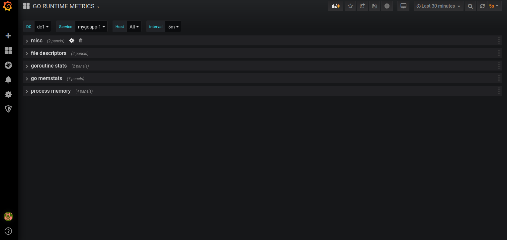
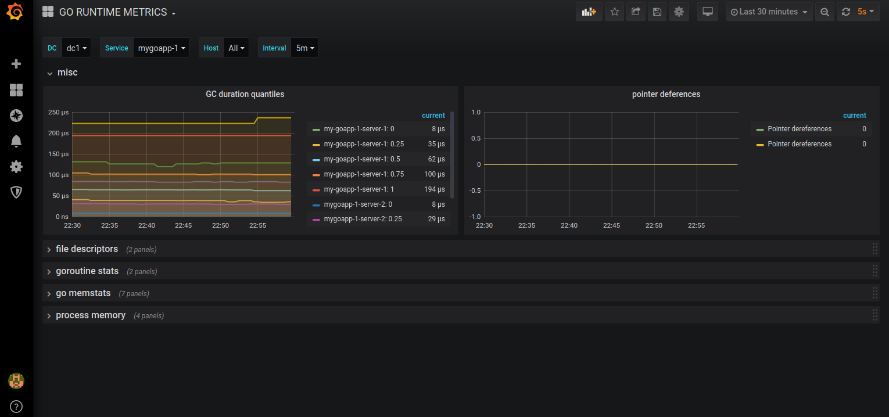
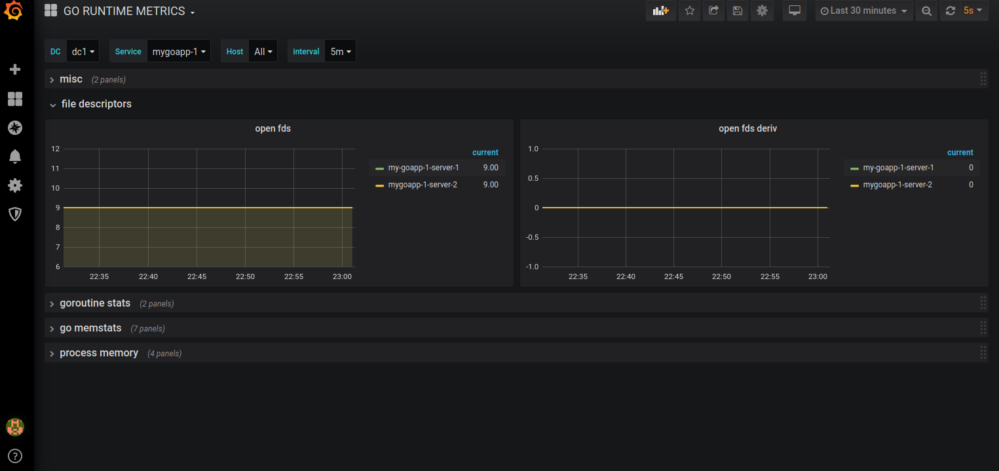
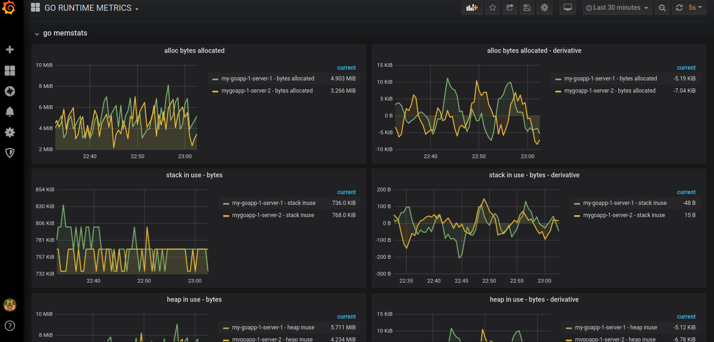
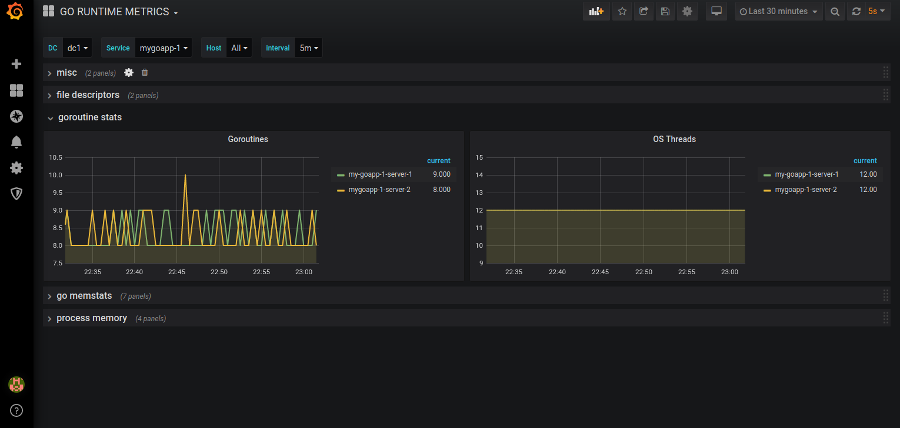
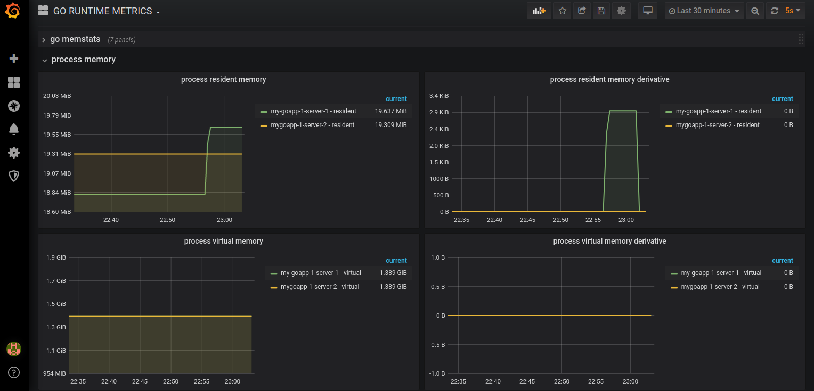

# go_runtime_grafana

This repository provides a Grafana dashboard, exported as JSON, for monitoring GOLang runtime of applications in a DC based
setup where a given application is deployed on a cluster of servers in a given Data center (on prem or cloud). This dashboard
groups together servers by the services being run on them, and services by the DC they are being served from.

It is possible to select one or multiple DC, and one or multiple hosts for a given service to compare metrics cross hosts and
cross DC.

This requires runtime metrics to be exported by the application using prometheus client library for GOLang

## Exporting GOLang metrices

Given below is a simple, tiny code snippet for enabling your application to expose prometheus metrics at ```/metrics```
endpoint

```
package main

import (
        "net/http"
        "github.com/prometheus/client_golang/prometheus/promhttp"
)


func main() {

        http.Handle("/metrics/", promhttp.Handler())
        http.ListenAndServe(":8888", nil)
}

```

This will expose Go runtime metrics at ```http://127.0.0.1:8888/metrics```

You can send custom metrics to. You can find out more about instrumenting your GOLang app with Prometheus at ther
offician <a href="https://prometheus.io/docs/guides/go-application/" target="_blank">documentation</a>.

## Adding a target in Prometheus 

Your target must have 3 labels attached to them. These are as follows

- **dc** - The dc where this service and its hosts are deployed. This is just a nomenclature, you can group your service
           by cluster, team, or any other nomenclature.

- **service** - Name of the service

- **hostname** - Name of the server or anything that will uniquely identify the server.

Example target configuration:

```
- job_name: 'mygoapp-1-dc-1'
    static_configs:
      - targets: ['127.0.0.1:2112']
        labels:
            dc: "dc1"
            hostname: "my-goapp-1-server-1"
            service: "mygoapp-1"
      - targets: ['127.0.0.1:2113']
        labels:
            dc: "dc1"
            hostname: "mygoapp-1-server-2"
            service: "mygoapp-1"
- job_name: 'mygoapp-2-dc-1'
    static_configs:
      - targets: ['127.0.0.1:2114']
        labels:
            dc: "dc1"
            hostname: "my-goapp-2-server-1"
            service: "mygoapp-2"
      - targets: ['127.0.0.1:2114']
        labels:
            dc: "dc1"
            hostname: "mygoapp-2-server-2"
            service: "mygoapp-2"
 
```

## Monitored metrices

Some of the runtime metrics this dashboard visualises :

- Process resident memory
- Process virtual memory
- Stack memory
- Heap memory
- Allocs
- Open file descriptors
- Pointer dereference
- Number of Goroutines
- Number of OS threads
- GC time

## How it looks like

<table>
        <tr>
                <td></td>
                <td></td>
        </tr>
         <tr>
                <td></td>
                <td></td>
        </tr>
        <tr>
                <td></td>
                <td></td>
        </tr>
</table>


